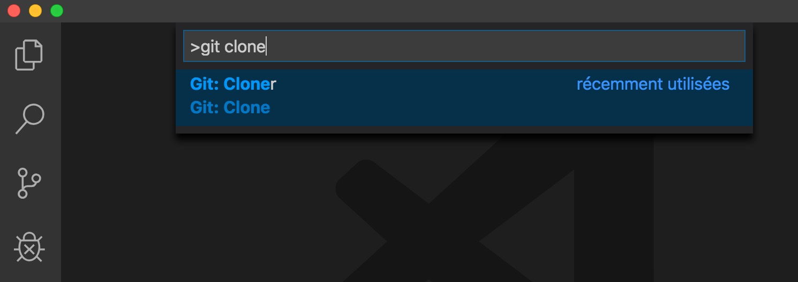
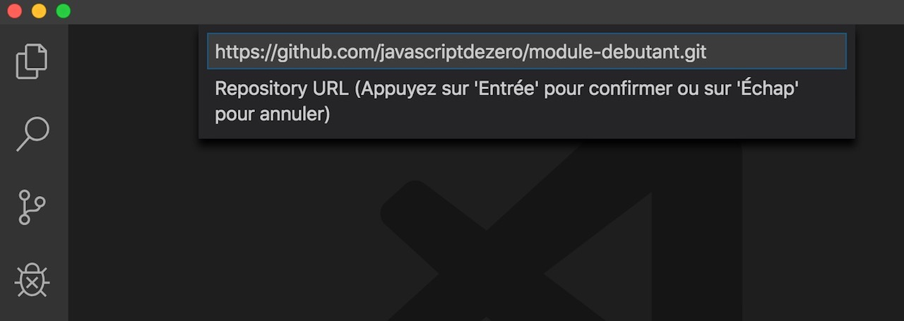
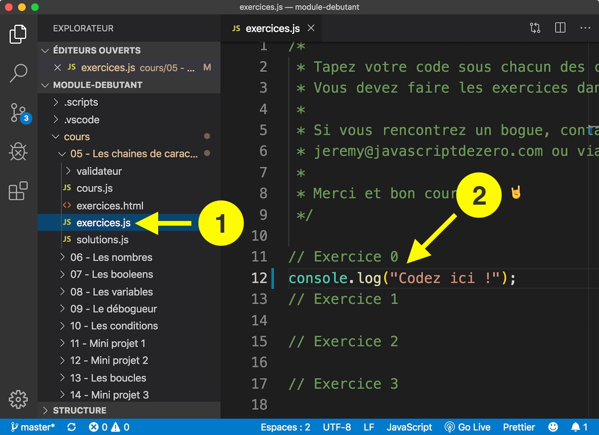
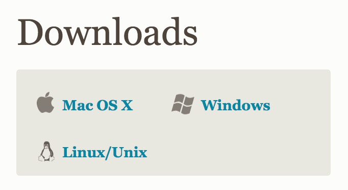

# Cours

## Exercices

Pour faire les exercices [suivez ces instructions](#En-savoir-plus-sur-les-exercices).

> Les noms de fichiers et répertoires sont sans accents pour éviter des problèmes dans Visual Studio Code.

## Vidéos

Pour lire l'intégralité de ces vidéos dans l'ordre, utilisez la [playlist YouTube du module débutant](https://www.youtube.com/watch?v=JeqZNiAhnlE&list=PLyj4q0fkISxAPXLZqNq5gCKcCVLBqL9nB).

Utilisez la fonction recherche du navigateur pour trouver ce qui vous intéresse rapidement. Cliquez sur la durée du sommaire de la vidéo pour accéder directement à la partie qui vous intéresse.

1. [Présentation du module débutant [M0L00]](https://www.youtube.com/watch?v=JeqZNiAhnlE)

   - [00:15](https://www.youtube.com/watch?v=JeqZNiAhnlE&t=15s) À qui s'adresse ce module ?
   - [00:30](https://www.youtube.com/watch?v=JeqZNiAhnlE&t=30s) Ce que vous allez apprendre
   - [00:50](https://www.youtube.com/watch?v=JeqZNiAhnlE&t=50s) Objectifs du module
   - [01:30](https://www.youtube.com/watch?v=JeqZNiAhnlE&t=90s) Format des leçons
   - [02:00](https://www.youtube.com/watch?v=JeqZNiAhnlE&t=120s) Pourquoi une formation en Français ?
   - [02:50](https://www.youtube.com/watch?v=JeqZNiAhnlE&t=170s) Sources d'informations techniques (livres)
   - [03:12](https://www.youtube.com/watch?v=JeqZNiAhnlE&t=192s) Culture du développeur
   - [03:36](https://www.youtube.com/watch?v=JeqZNiAhnlE&t=216s) Conseils aux débutants
   - [04:35](https://www.youtube.com/watch?v=JeqZNiAhnlE&t=275s) Exercices sur GitHub
   - [04:58](https://www.youtube.com/watch?v=JeqZNiAhnlE&t=298s) Questions et FAQ

2. [Comment installer Visual Studio Code et NodeJS (+2 alternatives) [M0L01]](https://www.youtube.com/watch?v=ig9EOn17vFM)

   - [00:28](https://www.youtube.com/watch?v=ig9EOn17vFM&t=28s) Téléchargement de Chrome
   - [01:08](https://www.youtube.com/watch?v=ig9EOn17vFM&t=68s) Installation de Chrome
   - [01:35](https://www.youtube.com/watch?v=ig9EOn17vFM&t=95s) Moteur JavaScript V8
   - [01:50](https://www.youtube.com/watch?v=ig9EOn17vFM&t=110s) La console JavaScript
   - [02:10](https://www.youtube.com/watch?v=ig9EOn17vFM&t=130s) Exécution de code JavaScript dans la console Chrome
   - [02:40](https://www.youtube.com/watch?v=ig9EOn17vFM&t=160s) Limitations de la console
   - [03:00](https://www.youtube.com/watch?v=ig9EOn17vFM&t=180s) Utiliser les snippets pour coder facilement
   - [04:30](https://www.youtube.com/watch?v=ig9EOn17vFM&t=270s) Installation de NodeJS
   - [04:35](https://www.youtube.com/watch?v=ig9EOn17vFM&t=275s) Astuce pour les Français pour traduire les pages web
   - [05:40](https://www.youtube.com/watch?v=ig9EOn17vFM&t=340s) Téléchargement de NodeJS et Visual Studio Code
   - [05:54](https://www.youtube.com/watch?v=ig9EOn17vFM&t=354s) Qu'est-ce que NodeJS ?
   - [06:10](https://www.youtube.com/watch?v=ig9EOn17vFM&t=370s) Installation de NodeJS
   - [06:27](https://www.youtube.com/watch?v=ig9EOn17vFM&t=387s) Démonstration NodeJS via le terminal
   - [07:50](https://www.youtube.com/watch?v=ig9EOn17vFM&t=470s) Installation de Visual Studio Code
   - [08:20](https://www.youtube.com/watch?v=ig9EOn17vFM&t=500s) Configuration du zoom de Visual Studio Code
   - [08:45](https://www.youtube.com/watch?v=ig9EOn17vFM&t=525s) Installation de l'extension pack Français pour VSCode
   - [10:35](https://www.youtube.com/watch?v=ig9EOn17vFM&t=635s) Comment sauvegarder un fichier sous VSCode
   - [11:20](https://www.youtube.com/watch?v=ig9EOn17vFM&t=680s) Raccourci @sort:installs sous VSCode
   - [11:45](https://www.youtube.com/watch?v=ig9EOn17vFM&t=705s) Installation de Bracket Pair Colorizer et Live Share
   - [12:47](https://www.youtube.com/watch?v=ig9EOn17vFM&t=767s) Création d'un projet JavaScript de test dans VSCode
   - [13:50](https://www.youtube.com/watch?v=ig9EOn17vFM&t=830s) Exécution du code JavaScript (sans débogueur)
   - [14:25](https://www.youtube.com/watch?v=ig9EOn17vFM&t=865s) Comment déboguer du code JavaScript
   - [15:30](https://www.youtube.com/watch?v=ig9EOn17vFM&t=930s) Configuration de Team Chat pour Slack
   - [16:18](https://www.youtube.com/watch?v=ig9EOn17vFM&t=978s) Alternatives à VSCode en ligne
   - [16:48](https://www.youtube.com/watch?v=ig9EOn17vFM&t=1008s) Présentation de Thimble de Mozilla
   - [18:00](https://www.youtube.com/watch?v=ig9EOn17vFM&t=1080s) Déboguer avec Thimble
   - [19:28](https://www.youtube.com/watch?v=ig9EOn17vFM&t=1168s) Présentation de JSFiddle
   - [20:45](https://www.youtube.com/watch?v=ig9EOn17vFM&t=1245s) Déboguer avec JSFiddle
   - [21:00](https://www.youtube.com/watch?v=ig9EOn17vFM&t=1260s) Sauvegarder son code en ligne via JSFiddle
   - [21:55](https://www.youtube.com/watch?v=ig9EOn17vFM&t=1315s) Des questions ? N'oubliez pas de cliquer sur J'aime ! MERCI !

3. [Votre premier programme JavaScript (avec Visual Studio Code) [M0L02]](https://www.youtube.com/watch?v=NRmlXat3U_o)

   - [00:24](https://www.youtube.com/watch?v=NRmlXat3U_o&t=24s) Création d'un nouveau projet sous Visual Studio Code
   - [01:15](https://www.youtube.com/watch?v=NRmlXat3U_o&t=75s) Création d'un nouveau fichier
   - [01:52](https://www.youtube.com/watch?v=NRmlXat3U_o&t=112s) Sauvegarder un fichier sous Visual Studio Code
   - [02:20](https://www.youtube.com/watch?v=NRmlXat3U_o&t=140s) Extension de fichier .js (code JavaScript)
   - [02:33](https://www.youtube.com/watch?v=NRmlXat3U_o&t=153s) Coloration syntaxique du langage JavaScript
   - [02:55](https://www.youtube.com/watch?v=NRmlXat3U_o&t=175s) Qu'est-ce qu'une instruction ?
   - [03:08](https://www.youtube.com/watch?v=NRmlXat3U_o&t=188s) Configuration de Visual Studio Code
   - [03:30](https://www.youtube.com/watch?v=NRmlXat3U_o&t=210s) Activer la sauvegarde automatique dans Visual Studio Code
   - [04:10](https://www.youtube.com/watch?v=NRmlXat3U_o&t=250s) Démonstration sauvegarde automatique
   - [04:40](https://www.youtube.com/watch?v=NRmlXat3U_o&t=280s) Arrêter le clignotement du curseur
   - [05:07](https://www.youtube.com/watch?v=NRmlXat3U_o&t=307s) Lecture du code par l'interpréteur JavaScript
   - [05:28](https://www.youtube.com/watch?v=NRmlXat3U_o&t=328s) Exécution du programme
   - [05:34](https://www.youtube.com/watch?v=NRmlXat3U_o&t=334s) Afficher la console de débogage
   - [06:10](https://www.youtube.com/watch?v=NRmlXat3U_o&t=370s) Modification du programme pour afficher une sortie différente
   - [06:38](https://www.youtube.com/watch?v=NRmlXat3U_o&t=398s) Raccourci clavier pour déplacer une ligne de code ou un bloc de code
   - [07:45](https://www.youtube.com/watch?v=NRmlXat3U_o&t=465s) Deux instructions sur la même ligne
   - [08:15](https://www.youtube.com/watch?v=NRmlXat3U_o&t=495s) Les lignes vides sont ignorées
   - [08:40](https://www.youtube.com/watch?v=NRmlXat3U_o&t=520s) Les commentaires en JavaScript
   - [08:55](https://www.youtube.com/watch?v=NRmlXat3U_o&t=535s) Ecrire un commentaire sur une ligne avec le double slash
   - [09:35](https://www.youtube.com/watch?v=NRmlXat3U_o&t=575s) Raccourci clavier pour commenter une ligne sous Visual Studio Code
   - [09:55](https://www.youtube.com/watch?v=NRmlXat3U_o&t=595s) Commentaires sur plusieurs lignes avec /_ et _/
   - [10:14](https://www.youtube.com/watch?v=NRmlXat3U_o&t=614s) Utiliser les commentaires pour désactiver/déboguer du code
   - [11:10](https://www.youtube.com/watch?v=NRmlXat3U_o&t=670s) La guerre des point-virgules (voir la FAQ sur GitHub)
   - [12:47](https://www.youtube.com/watch?v=NRmlXat3U_o&t=767s) Dépôt GitHub de la formation, comment bien l'utiliser ?
   - [14:00](https://www.youtube.com/watch?v=NRmlXat3U_o&t=840s) Des questions ? Cliquez sur J'aime, merci :) !

4. [Comment utiliser la documentation JavaScript ? (MDN et DevDocs.io) [M0L03]](https://www.youtube.com/watch?v=jnbiNr9b_lk)

   - [00:14](https://www.youtube.com/watch?v=jnbiNr9b_lk&t=14s) Pourquoi j'enseigne l'utilisation de la doc ?
   - [00:36](https://www.youtube.com/watch?v=jnbiNr9b_lk&t=36s) L'erreur FATALE des cours de programmation
   - [00:55](https://www.youtube.com/watch?v=jnbiNr9b_lk&t=55s) Dépendance aux cours
   - [01:02](https://www.youtube.com/watch?v=jnbiNr9b_lk&t=62s) Vous ne savez pas déboguer par vous-même
   - [01:26](https://www.youtube.com/watch?v=jnbiNr9b_lk&t=86s) Les sources de documentation
   - [01:41](https://www.youtube.com/watch?v=jnbiNr9b_lk&t=101s) Le MDN (Mozilla Developer Network)
   - [01:55](https://www.youtube.com/watch?v=jnbiNr9b_lk&t=115s) ASTUCE: lien mdn.io
   - [02:13](https://www.youtube.com/watch?v=jnbiNr9b_lk&t=133s) Qu'est-ce que le MDN ?
   - [02:34](https://www.youtube.com/watch?v=jnbiNr9b_lk&t=154s) Mettre le MDN en Français
   - [02:48](https://www.youtube.com/watch?v=jnbiNr9b_lk&t=168s) Les pages de référence sont en Anglais
   - [03:23](https://www.youtube.com/watch?v=jnbiNr9b_lk&t=203s) Différence de contenu entre Anglais / Français avec la page reduce()
   - [03:26](https://www.youtube.com/watch?v=jnbiNr9b_lk&t=206s) Changer la langue de la documentation sur le MDN
   - [03:43](https://www.youtube.com/watch?v=jnbiNr9b_lk&t=223s) Exemple de différences dans les pages de doc
   - [04:18](https://www.youtube.com/watch?v=jnbiNr9b_lk&t=258s) Les inconvénients du MDN
   - [04:27](https://www.youtube.com/watch?v=jnbiNr9b_lk&t=267s) DevDocs.io
   - [05:00](https://www.youtube.com/watch?v=jnbiNr9b_lk&t=300s) Cours rapide sur DevDocs
   - [05:19](https://www.youtube.com/watch?v=jnbiNr9b_lk&t=319s) Activer les données hors ligne
   - [05:29](https://www.youtube.com/watch?v=jnbiNr9b_lk&t=329s) Effectuer une recherche sur DevDocs
   - [05:49](https://www.youtube.com/watch?v=jnbiNr9b_lk&t=349s) Démonstration DevDocs hors ligne (sans accès internet)
   - [06:25](https://www.youtube.com/watch?v=jnbiNr9b_lk&t=385s) Utiliser la barre d'adresse Google Chrome comme moteur de recherche
   - [06:47](https://www.youtube.com/watch?v=jnbiNr9b_lk&t=407s) Démonstration avec DevDocs.io
   - [07:00](https://www.youtube.com/watch?v=jnbiNr9b_lk&t=420s) La spécification ECMAScript
   - [07:52](https://www.youtube.com/watch?v=jnbiNr9b_lk&t=472s) ASTUCE DE PRO : créer des raccourcis pour chercher directement dans les docs JS depuis la barre d'adresse Chrome
   - [08:30](https://www.youtube.com/watch?v=jnbiNr9b_lk&t=510s) Configuration pour le raccourci vers DevDocs.io
   - [08:47](https://www.youtube.com/watch?v=jnbiNr9b_lk&t=527s) Configuration pour le raccourci vers le MDN en français
   - [09:00](https://www.youtube.com/watch?v=jnbiNr9b_lk&t=540s) Démonstration 'dd reduce' renvoie vers la page reduce() de DevDocs
   - [09:11](https://www.youtube.com/watch?v=jnbiNr9b_lk&t=551s) Démonstration 'mdn reduce' renvoie vers la page reduce() de MDN (fr)
   - [09:23](https://www.youtube.com/watch?v=jnbiNr9b_lk&t=563s) Des questions ? N'oubliez pas de cliquer sur J'aime, MERCI !

5. [Comment lire la documentation JavaScript du MDN ? [M0L04]](https://www.youtube.com/watch?v=J7IFmQhKpd0)
   - [00:12](https://www.youtube.com/watch?v=J7IFmQhKpd0&t=12s) Rappel sur console.log
   - [00:31](https://www.youtube.com/watch?v=J7IFmQhKpd0&t=31s) Recherche de console.log sur le MDN
   - [00:47](https://www.youtube.com/watch?v=J7IFmQhKpd0&t=47s) Mettre la page de documentation en Français
   - [00:57](https://www.youtube.com/watch?v=J7IFmQhKpd0&t=57s) Les différentes sections de la documentation
   - [01:10](https://www.youtube.com/watch?v=J7IFmQhKpd0&t=70s) Syntaxe (explications)
   - [01:48](https://www.youtube.com/watch?v=J7IFmQhKpd0&t=108s) Paramètres
   - [02:23](https://www.youtube.com/watch?v=J7IFmQhKpd0&t=143s) Si vous ne comprenez pas tout, c'est normal !
   - [02:40](https://www.youtube.com/watch?v=J7IFmQhKpd0&t=160s) Spécification
   - [02:50](https://www.youtube.com/watch?v=J7IFmQhKpd0&t=170s) Compatibilité des navigateurs
   - [03:11](https://www.youtube.com/watch?v=J7IFmQhKpd0&t=191s) Définition de "supporter"
   - [03:23](https://www.youtube.com/watch?v=J7IFmQhKpd0&t=203s) Informations complémentaires
   - [03:35](https://www.youtube.com/watch?v=J7IFmQhKpd0&t=215s) Voir aussi
   - [03:50](https://www.youtube.com/watch?v=J7IFmQhKpd0&t=230s) Méthode reduce (recherche sur le MDN)
   - [04:05](https://www.youtube.com/watch?v=J7IFmQhKpd0&t=245s) Bloc de démonstration JavaScript Array.reduce
   - [04:50](https://www.youtube.com/watch?v=J7IFmQhKpd0&t=290s) Utilité du bloc JavaScript démo dans la doc
   - [05:00](https://www.youtube.com/watch?v=J7IFmQhKpd0&t=300s) Syntaxe de reduce
   - [05:10](https://www.youtube.com/watch?v=J7IFmQhKpd0&t=310s) Description détaillée et exemples
   - [05:28](https://www.youtube.com/watch?v=J7IFmQhKpd0&t=328s) Exemples concrets supplémentaires
   - [06:17](https://www.youtube.com/watch?v=J7IFmQhKpd0&t=377s) Polyfill (prothèse d'émulation)
   - [06:28](https://www.youtube.com/watch?v=J7IFmQhKpd0&t=388s) Spécification
   - [06:48](https://www.youtube.com/watch?v=J7IFmQhKpd0&t=408s) Informations générales sur un sujet comme Console
   - [07:07](https://www.youtube.com/watch?v=J7IFmQhKpd0&t=427s) Sujet associé : console
   - [07:16](https://www.youtube.com/watch?v=J7IFmQhKpd0&t=436s) Liste des méthodes de console
   - [07:30](https://www.youtube.com/watch?v=J7IFmQhKpd0&t=450s) Méthode clear()
   - [07:41](https://www.youtube.com/watch?v=J7IFmQhKpd0&t=461s) Accès à la doc globale de console
   - [08:28](https://www.youtube.com/watch?v=J7IFmQhKpd0&t=508s) Une formation qui rend indépendant
   - [09:03](https://www.youtube.com/watch?v=J7IFmQhKpd0&t=543s) Des questions ?
   - [09:12](https://www.youtube.com/watch?v=J7IFmQhKpd0&t=552s) Merci de cliquer sur J'aime et abonnez-vous :)

## En savoir plus sur les exercices

### Comment faire les exercices ?

Voici les instructions à suivre pour faire les exercices depuis Visual Studio Code.

1. Ouvrez Visual Studio Code.
2. Allez dans l'onglet **Extensions** en cliquant sur l'icône depuis le panneau latéral de gauche. Vous pouvez également utiliser le raccourci clavier `⇧⌘X` sur Mac ou `Ctrl+Shift+X` sous Windows/Linux.

3. Installez l'extension **live server** (par Ritwick Dey).
   
4. Redémarrez Visual Studio Code pour prendre en compte cette extension.
5. Téléchargez le dépôt GitHub de la formation :
   1. Ouvrez la palette de commandes depuis le menu **Afficher > Palette de commandes** (raccourci clavier `⇧⌘P` sur Mac ou `Ctrl+Shift+P` sous Windows/Linux) puis tapez `git clone` et validez avec ENTRÉE.
      
   2. Si une erreur apparaît en bas à droite après avoir appuyé sur ENTRÉE il faut [installer Git](#installer-git) avant de continuer. Une fois que c'est fait suivez les instructions suivantes.
      
   3. Copier-collez le lien du dépôt GitHub de la formation et validez : https://github.com/javascriptdezero/module-debutant.git (attention à ne pas insérer d'espace en trop à la fin du lien !)
      
   4. Visual Studio Code va vous demander dans quel répertoire vous voulez télécharger le dépôt GitHub de la formation. Sélectionnez le répertoire de votre choix (par exemple **Documents**), puis validez.
   5. Une fois le téléchargement effectué vous aurez un nouveau répertoire **Documents/module-debutant**. Visual Studio Code va vous demander dans une popup en bas à droite si vous voulez ouvrir le dépôt cloné : cliquez sur le bouton **Ouvrir le dépôt**.
      
   6. Si vous ne voyez pas la popup de l'étape précédente, utilisez le menu **Fichier > Ouvrir** puis sélectionnez le répertoire **Documents/module-debutant**. Sélectionnez bien le répertoire **module-parent** et pas **Documents** avant de cliquer sur `Ouvrir`.
6. Dans ce nouveau projet, cliquez sur le répertoire **cours** puis sur le cours de votre choix par exemple **05 - Les chaines de caractères**.
   
7. Sélectionnez le fichier **exercices.html** (ou un des fichiers se terminant par **.html**).
8. Lancez le serveur Web en cliquant sur **Go Live** tout en bas dans la barre d'état bleue.
9. Le navigateur Chrome devrait se lancer tout seul et vous afficher les exercices.
10. Dernière étape ouvrez le fichier **exercices.js** (ou le fichier se terminant par **.js**) pour commencer à coder vos réponses !
    
11. Dès que vous enregistrez vos modifications dans le fichier **exercices.js** le navigateur se mettra à jour et vous dira si vous avez réussi ou pas les exercices. Bon courage !
12. Pour faire les exercices d'un autre cours, il suffit de recommencer à l'étape 6 en sélectionnant le cours de votre choix.
13. Comme je mets à jour régulièrement les exercices, pensez à lire la section [mettre à jour le dépôt Git de la formation](#Mettre-à-jour-le-dépôt-Git-de-la-formation).
14. Pour toute question, merci de me contacter via [Slack](https://javascriptdezero.slack.com).

### Mettre à jour le dépôt Git de la formation

Je mets à jour le dépôt Git de la formation régulièrement en ajoutant de nouveaux exercices et du contenu. Pensez à mettre à jour votre dépôt de temps en temps en suivant les instructions ci-dessous.

> Vous devez être connecté à Internet pour que la mise à jour puisse s'effectuer.

Voici les étapes à suivre en image :

Quelques explications plus détaillées :

1. Ouvrez Visual Studio Code.
2. Ouvrez le dépôt Git de la formation : allez dans le menu **Fichier > Ouvrir** et sélectionnez le répertoire du dépôt sur votre ordinateur (**Documents/module-debutant** pour continuer sur notre exemple).
3. Depuis ce projet, sélectionnez sur le panneau latéral gauche l'icône **debug** (étape 1 de l'image).
4. Sélectionnez **Mettre à jour le dépôt** dans le menu déroulant du haut (étape 2 de l'image).
5. Ouvrez la console de déboguage : cliquez sur l'icône terminal à droite du menu déroulant (étape 3 de l'image).
6. Lancez la mise à jour en cliquant sur le bouton **Lecture** à gauche du menu déroulant (étape 4 de l'image).
7. Vérifiez que tout se passe bien dans la console de déboguage.

J'ai créé ce procédé pour faciliter l'accès aux exercices par les néophytes qui ne connaissent pas Git.

Mais si vous connaissez Git vous n'avez pas besoin d'utiliser ce processus pour mettre à jour le dépôt. Vous pouvez simplement faire des `git pull` de temps en temps.

### Installer Git

Si l'erreur suivante apparaît après avoir tapé `git clone` dans la palette de commandes :

C'est qu'il faut installer Git sur votre machine :

1. Rendez-vous sur [git-scm.com](https://git-scm.com/download).
2. Cliquez sur le système d'exploitation que vous utilisez (Windows ou Linux ou Mac OS).
   
3. Installez Git (cliquez sur **Next** plusieurs fois). Vérifiez bien de sélectionner l'option **Use Git from the Windows Command Prompt** lorsque cet écran s'affiche :

   

4. Cliquez sur **Next** jusqu'à la fin de l'installation de Git.
5. Une fois que c'est fait, fermez complètement Visual Studio Code et relancez-le. Vous pourrez maintenant utiliser la commande `git clone` dans la palette de commandes.

### Approche générale

Ces exercices ont été conçus pour vous permettre de valider par la pratique chaque leçon.

Le but est de commencer avec un exercice bête et méchant qui applique sans piège une connaissance enseignée dans la vidéo.

Petit à petit, la difficulté augmente jusqu'à finir par poser des questions qui ne sont pas traitées dans la leçon.

Vous devrez alors vous entraîner à consulter la documentation pour trouver comment faire. C'est là toute l'essence du métier de développeur : réussir à chercher par soi-même la réponse à un problème donné.

### Chassez les bogues !

L'objectif de ce type d'exercice est de trouver et corriger le ou les bugs d'un programme informatique.

Là aussi il s'agit d'entraîner votre logique et votre capacité de lecture et d'analyse d'un programme informatique écrit par autrui. Une compétence indispensable pour devenir développeur et contribuer à des projets déjà existants.

### Bonnes pratiques

Voici quelques conseils pour résoudre les exercices :

- Prenez votre temps, ce n'est pas chronométré !
- Modifiez le nom des variables si ça vous aide à mieux comprendre la logique du programme
- Formatez le programme pour séparer les différentes phases de celui-ci, quelques lignes vides et espaces bien placés font parfois des miracles !
- Résolvez les exercices dans l'ordre. La difficulté est croissante et certains exercices utilisent le précédent comme base de solution
- Utilisez le débogueur pour vous aider à comprendre le fonctionnement du programme rapidement
- Si vous bloquez sur un exercice, prenez une pause comme je l'explique dans la section ["Sortir d'une situation bloquante" sur cette vidéo](https://www.youtube.com/watch?v=LtsubKU8dzA&t=298s).
- Si vous bloquez toujours, venez demander des indices sur le [Slack de la formation](https://javascriptdezero.slack.com)

### Contributions

Vous pouvez contribuer et me soumettre vos propres exercices pour enrichir la liste !

Si vous résolvez un exercice non listé ici qui vous a permis d'apprendre quelque chose, transmettez-le moi. Je l'ajouterai avec plaisir pour en faire bénéficier la communauté.

Vous pouvez m'envoyer un email à cette adresse : jeremy@javascriptdezero.com. Vous pouvez également utiliser les _pull requests_ de GitHub.
